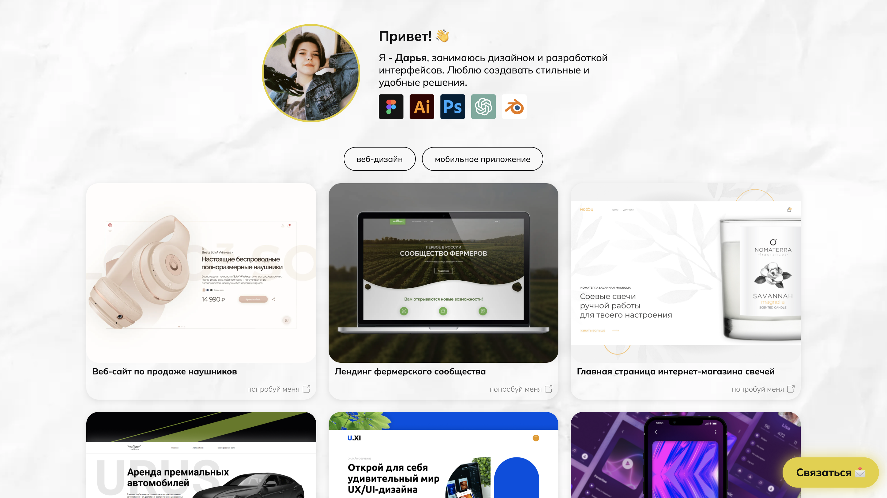

# 🎨 Портфолио | Дарья Натальина

Добро пожаловать в мое портфолио! Здесь вы найдете мои работы в области дизайна и UI/UX.  

🔗 [Посмотреть работы](https://phoenix423.github.io/dar_natalin/) | 📩 [Связаться со мной](https://phoenix423.github.io/dar_natalin/#contacts)

---

## 🚀 О проекте

Этот сайт-портфолио создан для демонстрации моих навыков и работ.  
Я использую **Figma, Photoshop, Illustrator, Blender** и работаю на фрилансе в области **продуктового дизайна**.



---

## ✨ Функционал

- 🎨 **Галерея проектов** с фильтрацией по категориям
- 🖥️ **Адаптивный дизайн** для всех устройств
- 🌍 **Быстрая загрузка** и кроссбраузерная совместимость
- 🔗 **Ссылки на Behance, Telegram, Email** для связи

---

## 📂 Структура проекта

```bash
📁 portfolio/
 ┣ 📁 images/          # Изображения и превью работ
 ┣ 📄 index.html       # Главная страница
 ┣ 📄 cases.json       # Данные о проектах
 ┣ 📄 styles.css       # Основные стили
 ┗ 📄 README.md        # Этот файл
